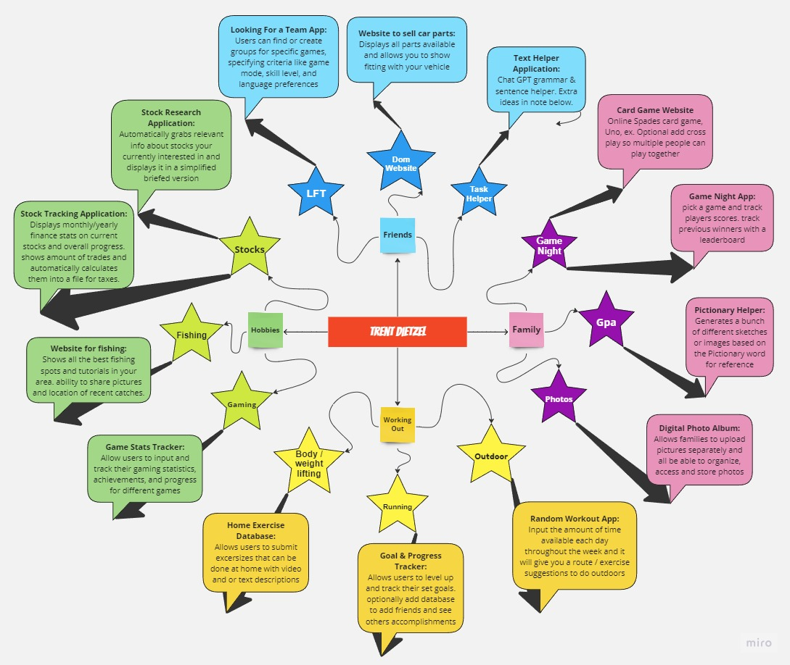

# *Idea Board Outline - Capstone Prep*
#### By Trent Dietzel

## About: Game Night
*Game Night Central is an online card game platform that hosts popular games like Spades, Uno, and more. Users can create accounts, where players can track their statistics, current game scores, achievements & view the leaderboards across different card games. It would be aiming to create a memorable and enjoyable experiences by offering a diverse range of games with built in helpers. The platform encourages social interaction, friendly competition, and the joy of shared gaming moments, making it the go-to destination for virtual game nights.*

#### Initial Features:
+ Host and join virtual card game rooms featuring popular games like Spades, Uno, Poker, and more.
+ Include a user profile section to track statistics and achievements across different card games.
+ Include a Pictionary Helper Studio within the platform.
+ Input Pictionary words, and the app generates sketches or images for reference during the drawing phase.

#### Extra Features:
+ Notification System: Keep users informed about upcoming game nights, invitations, and new features through a notification system.
+ Customizable Themes: Let users personalize their virtual game night experience with customizable themes, backgrounds, and avatars.
+ Virtual Lounge: A social space where users can interact, chat, and plan upcoming game nights. This could include a virtual environment where users can represent themselves with avatars and engage in pre-game banter.

### Possible Front End Technology needed
+ HTML/CSS/JavaScript
+ React
+ WebSocket?
  
### Possible Back End Technology needed
+ Node.js, Python, Ruby
+ Database
+ Socket.io?

### Additional Tech:
+ Authentication
+ Cloud Services
+ Push Notification Service
